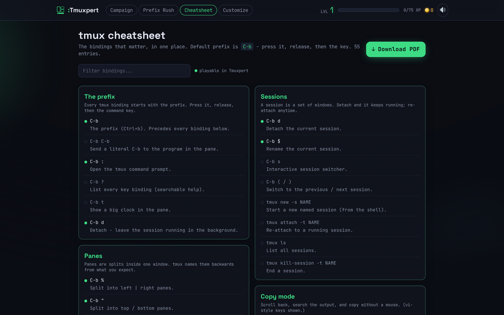
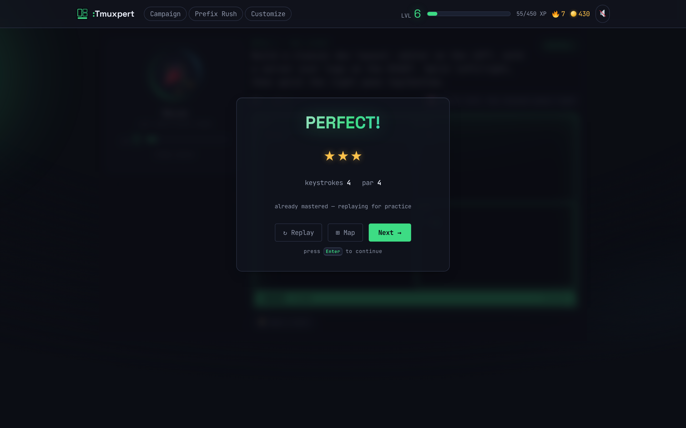

<div align="center">


# :TmuxLegends

**Learn tmux by playing.** Real prefix keys, real muscle memory, no config to memorize.

[](tsconfig.json)
[](package.json)
[](vite.config.ts)
[](tests)
[](#-run-it)


</div>

You learn tmux the way you actually use it. Press the **prefix** (`Ctrl-b`), then a key:
split panes, flip windows, detach sessions, grep the scrollback in copy mode. Every
challenge is scored VimGolf-style against a **par**.

> [!TIP]
> **Try it in 30 seconds:** run `npm install && npm run dev`, then on level 1 press
> <kbd>Ctrl-b</kbd> then <kbd>%</kbd> and you've split your first pane at par. It escalates
> from there. 🙂

---

## ✨ What's inside

| | |
|---|---|
| 🎯 **Par scoring** | every keystroke counts, so beat *par* for ⭐⭐⭐ |
| 🧩 **A real tmux model** | challenges verify actual tmux state (pane trees, layouts, window/session names, copy-mode selection), not just "did you press the right key" |
| 👾 **Boss fights** | multi-stage scenarios with a **keystroke-budget** bar; run out and you're *repelled*, but losing costs nothing but a retry |
| 🤖 **Muxie, your Hero** | one customizable companion - style its colors, visor, accessory and aura, then watch it idle, react while you type, and celebrate your wins |
| ⌨️ **Binding Belt** | your growing, category-grouped collection of mastered bindings |
| 🕹️ **Prefix Rush** | a 30-second reflex drill for prefix-then-key muscle memory |
| 📱 **Quiz mode** | a touch-first, tap-to-answer trainer covering the whole curriculum — the mobile way to drill when the interactive surface isn't practical, no prefix key needed |
| 📄 **Cheatsheet** | a searchable, in-app tmux reference you can **download as a PDF** - generated fully offline with zero dependencies |
| 🎨 **Customize** | style your Hero for free, and spend coins on accent **themes** (the whole UI recolors live) and animated backgrounds |
| 🌌 **3D world layer** | an optional cel-shaded WebGL stage behind the smoked-glass panels, auto-detected per device and lazy-loaded - weak devices get an equally complete 2D tier |
| 💾 **Offline-first** | progress in `localStorage` with versioned migrations; fonts self-hosted, so it plays **fully offline**. An [optional backend](server/README.md) adds sign-in and verified score sharing - skip it and nothing is lost |

## 🗺️ The worlds

| | World | You learn | Boss |
|--|-------|-----------|------|
| 🟢 | **1 · Split** | the prefix epiphany · `%` `"` split · `o`/arrows move · `z` zoom · `x` kill | 🧩 The Workspace |
| 🔵 | **2 · Windows** | `c` new · `,` rename · `n` `p` next/prev · `0-9` jump · `&` kill | 🪟 The Tab Wrangler |
| 🟣 | **3 · Sessions & Copy** | `d` detach · `$` rename session · new session · `[` copy mode · search & `y` yank | 🆘 Session Rescue |
| 🟠 | **4 · Rearrange** | `Space` next-layout · `{` `}` swap panes · `!` break-pane into a window | 🔧 The Rebuild |
| 🔷 | **5 · Command Line** | the `:` prompt, e.g. `new-window`, `split-window`, `new-session`, `swap-window` | 🚀 Deploy Pipeline |
| 🟪 | **6 · Power User** | `:resize-pane` · `]` paste the buffer · `:swap-window` reorder · scripting layouts from the prompt | 🎛️ The Orchestrator |

**40 levels** (34 hand-authored challenges plus 6 multi-stage bosses), and **every par is
machine-proven solvable** (see [Testing](#-testing-pars-are-proven-not-guessed)).

<div align="center">
<table>
<tr>
<td></td>
<td></td>
</tr>
<tr>
<td align="center"><em>The interactive tmux surface, a goal, and Muxie</em></td>
<td align="center"><em>Star-rated progression: clear a world to unlock the next</em></td>
</tr>
<tr>
<td></td>
<td></td>
</tr>
<tr>
<td align="center"><em>Prefix Rush: drill the combos against the clock</em></td>
<td align="center"><em>Customize: spend coins on your look</em></td>
</tr>
<tr>
<td></td>
<td></td>
</tr>
<tr>
<td align="center"><em>Cheatsheet: search it, or download the whole thing as a PDF</em></td>
<td align="center"><em>Every solve is star-rated - fall short and retry for ⭐⭐⭐</em></td>
</tr>
</table>
</div>

## 💡 The one interesting design decision

TmuxLegends is a sibling of [VimLegends](https://github.com/Zeecka/VimLegends), a Vim trainer that embeds a *real* Vim
(`@replit/codemirror-vim`). There is no drop-in "real tmux in the browser", so TmuxLegends
ships a **pure-TypeScript tmux simulator**: a state machine over `sessions > windows >
panes` with tmux's modal, prefix-driven grammar (`normal > prefix > ...`), copy mode, and a
`:` command prompt.

Because it's pure data with **no DOM**, the *exact same reducer* drives the live surface and
the headless tests, so every level's par is machine-proven, not guessed.

## 🚀 Run it

```bash
npm install
npm run dev        # play at the printed localhost URL (Vite, port 5173)
npm run build      # static bundle in dist/ (deploy anywhere static)
npm run preview    # serve the production build (port 4173)
```

Deploy `dist/` anywhere static (Netlify, Vercel, GitHub Pages) - no special headers, it's a
plain SPA. The game is complete that way: accounts are purely additive, and with no `/api`
reachable the app reports offline and hides the account UI.

### 🐳 Or with Docker

```bash
docker compose -f docker-compose.dev.yml up   # HMR dev server on http://localhost:8972
docker compose up -d                          # production stack on http://localhost:8974
```

For dev, source is bind-mounted, so edits under `src/` hot-reload the browser with no rebuild.
The production stack serves the built SPA behind nginx and proxies `/api/` to the optional
accounts service; bring it up without OAuth credentials and accounts simply stay off. See
[`server/README.md`](server/README.md) to switch them on.

## 🧪 Testing: pars are proven, not guessed

```bash
npm test           # 80 vitest tests
npm run typecheck  # tsc across the project
npm run build      # production build
```

| Layer | What it guarantees |
|-------|--------------------|
| `tests/content.test.ts` | ids unique · taught bindings resolve to the catalog · boss budgets sane |
| `tests/par.test.ts` | **every challenge's par is achieved by a reference solution driven through the real engine**, including `:` commands, copy mode, and multi-stage bosses |
| `tests/pdf.test.ts` | the offline cheatsheet PDF parses back cleanly - every cross-reference byte-offset lands on its object and each stream length is exact |
| `tests/hero.test.ts` | the Hero resolves and normalizes · a v2 save's flat aura migrates · retired avatars are refunded to the coin, never silently dropped |
| `tests/keys.test.ts` | the keyboard-event → key-name mapping the surface reads is exact — Ctrl/Alt/Shift and AltGraph resolve correctly |
| `tests/driver.ts` | a headless key-runner that feeds keystrokes into the same `reduce()` the UI uses |

The optional backend has its own suite: `cd server && npm test` (55 tests, zero npm deps).

## 🏗️ Architecture

Same stack as VimLegends: **React 18 + TypeScript + Vite + Zustand + Tailwind v4 +
framer-motion**, self-hosted fonts, Web-Audio synth SFX, the "Nightglass" design system
(retheme accent to tmux green). The only subsystem that differs is the engine:
VimLegends's `src/editor/` (CodeMirror) becomes `src/tmux/` (the simulator).

```
src/
  tmux/      model.ts    state tree + pure tree ops + serializeLayout
             ops.ts      semantic verbs (split, killPane, newWindow, copy)
             engine.ts   reduce(state, key), the prefix-key grammar
             commands.ts the ':' command parser (new-window, split-window)
             catalog.ts  the binding catalog (curriculum spine + Binding Belt)
             verify.ts   composable goal predicates (paneCount, windowNamed)
             TmuxSurface.tsx  renders the pane tree + status bar, captures keys
  game/      types.ts (Challenge/Goal)  store.ts  xp.ts  sound.ts  runtime.ts  cosmetics.ts
             heroParts.ts (the Hero model + save migration)  quality.ts (webgl/lite tier)
             account.ts  share.ts  links.ts
             cheatsheet.ts (reference data)  pdf.ts (dependency-free PDF writer)
  three/     Stage3D.tsx (the WebGL underlay)  Hero3D.tsx  HeroExtras.tsx  AmbientScene.tsx
             backdrops.tsx (shader backdrops)  toon.ts  stageState.ts (UI <-> 3D bridge)
             sceneRegistry.ts (+ .meta.ts, the 3D-free mirror)
  content/   tier1.ts to tier6.ts  bosses.ts  tiers.ts  build.ts  quiz.ts (the Quiz question bank)
  modes/     CampaignMode.tsx  ArcadeMode.tsx  QuizMode.tsx
  ui/        Hud, WorldMap, ResultScreen, BindingBelt, HeroPanel, Shop, atoms
             HeroMark/Avatar (the 2D Hero)  Background/Parallax (the lite tier)
             Cheatsheet + CheatsheetModal  HowToPlay  Account  Profile
server/      optional accounts + verified-score API (zero npm deps) - see server/README.md
tests/       driver.ts  par.test.ts (every par proven)  content.test.ts  pdf.test.ts
             hero.test.ts (Hero + the v2->v3 avatar-refund migration)  keys.test.ts (event->key mapping)
```

## ✍️ Adding a challenge

Challenges are **pure data**. A new level is about 15 lines in a `src/content/tierN.ts` file:

```ts
{
  id: 't1-prefix',
  tier: 1,
  title: 'The Prefix',
  brief: 'Press the prefix (Ctrl-b), then % to split this pane left/right.',
  taughtCommands: ['prefix', 'split-h'],   // ids from catalog.ts
  start: single({ cmd: 'zsh' }),           // a starting TmuxState (see build.ts)
  goal: { predicate: allOf(paneCount(2), splitDirIs('h')), describe: 'Two panes, side by side' },
  par: 2,
  hint: 'Hold Ctrl, tap b, release, then press % (Shift+5).',
}
```

Then add a reference solution string to `SOLUTIONS` in `tests/par.test.ts` (e.g. `'C-b%'`)
and `npm test` will *prove* the par is achievable. A `Goal` is either a `targetLayout` string
(see `serializeLayout`) or a `predicate(state)` built from `src/tmux/verify.ts`. Bosses add
`kind:'boss'`, `stages[]`, and a `keystrokeBudget` (roughly `ceil(par * 2.2)`).

## 🧭 Deferred (structured to add later, exactly as VimLegends isolates them)

- **Per-level 3D scenes:** the stage, the shader backdrops and the registry all ship; no tmux
  level claims a bespoke world yet, so every screen falls through to the equipped backdrop.
  Register one in `src/three/sceneRegistry.ts` (and `sceneRegistry.meta.ts`) to add it - note
  TmuxLegends frames play with the surface on the *right*, mirroring VimLegends.
- **`.tmux.conf` capstones:** the command prompt already accepts `set`/`bind`/`source-file`
  as no-ops, but a config tier that *verifies option effects* needs the engine to model those
  effects first. (Tier 6 already ships `resize-pane`, paste, and command-line scripting.)

## 🙏 Credits

| | |
|---|---|
| 😀 UI glyphs & mascots | [Twemoji](https://github.com/jdecked/twemoji) (CC-BY 4.0), bundled locally |
| 🔤 Fonts | [Space Grotesk](https://fonts.google.com/specimen/Space+Grotesk) + [JetBrains Mono](https://www.jetbrains.com/lp/mono/) (OFL), self-hosted via Fontsource |

<div align="center">

**Free & open source. Prefix first, always.** ⌨️💚

</div>
