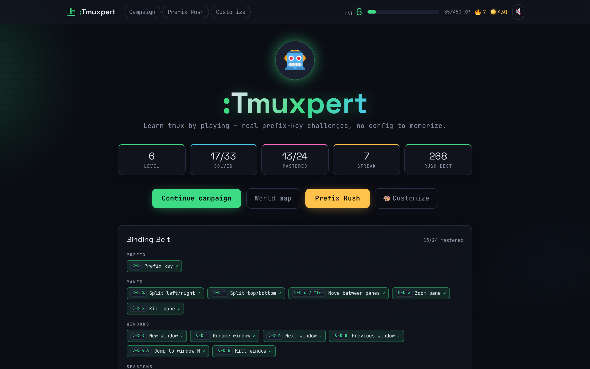
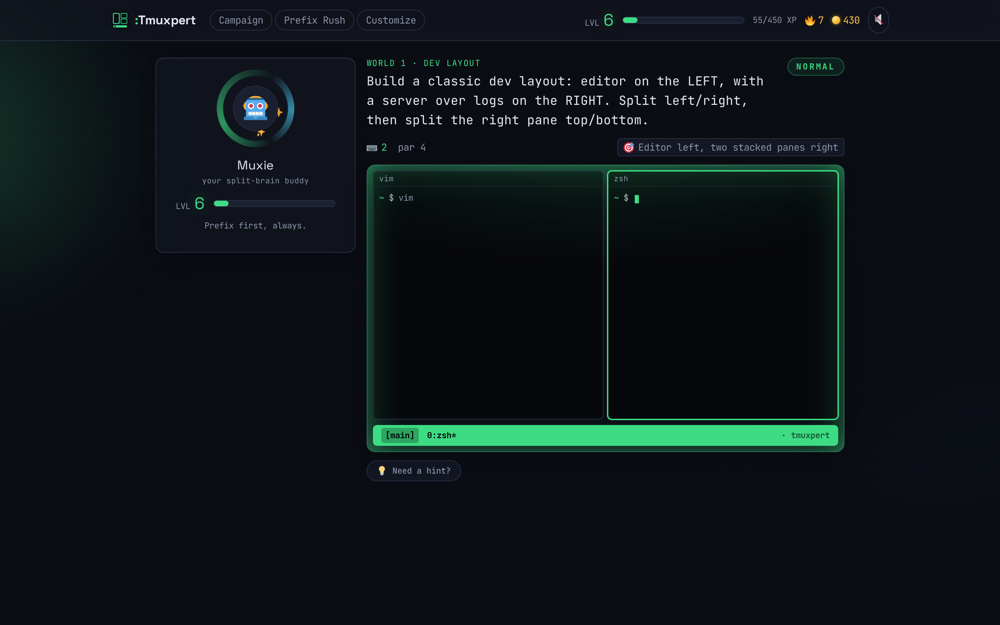
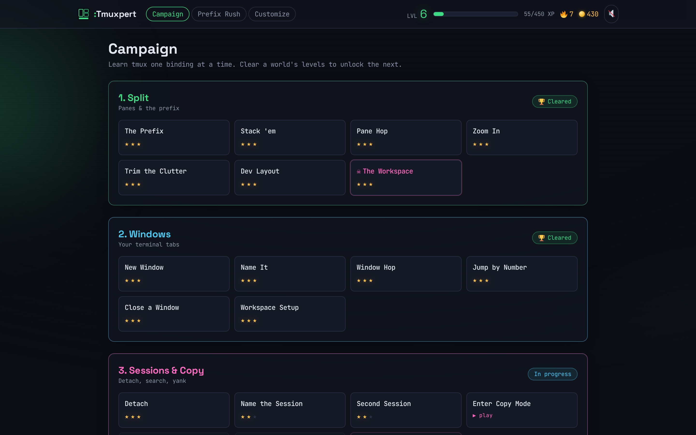
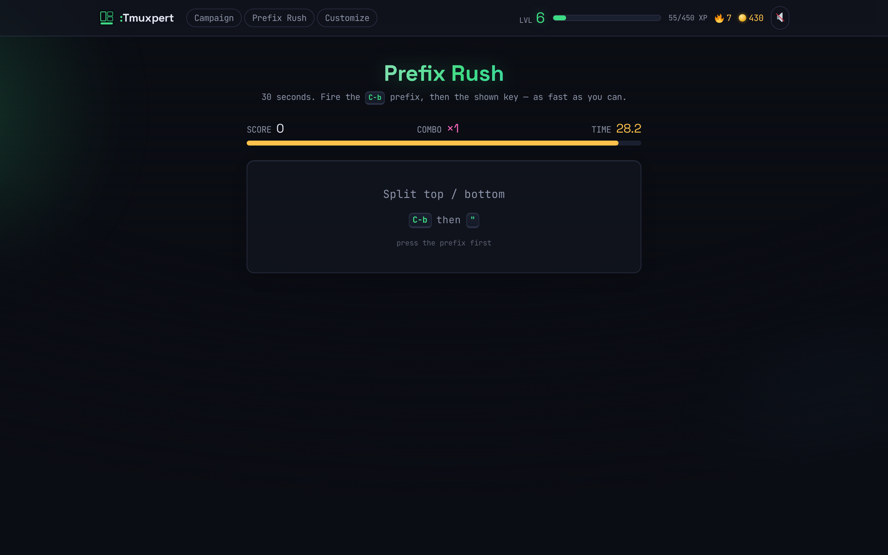
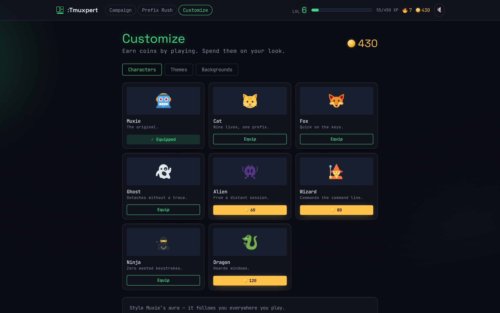

<div align="center">


# :Tmuxpert

**Learn tmux by playing.** Real prefix keys · real muscle memory · no config to memorize.

[](tsconfig.json)
[](package.json)
[](vite.config.ts)
[](tests)
[](#-run-it)



</div>

You learn tmux the way you actually use it: press the **prefix** (`Ctrl-b`), then a key —
split panes, flip windows, detach sessions, grep the scrollback in copy mode — each
challenge scored VimGolf-style against a **par**.

> [!TIP]
> **Try it in 30 seconds:** `npm install && npm run dev` → on level 1, press
> <kbd>Ctrl-b</kbd> then <kbd>%</kbd> and you've split your first pane at par. It escalates
> from there. 🙂

---

## ✨ What's inside

| | |
|---|---|
| 🎯 **Par scoring** | every keystroke counts — beat *par* for ⭐⭐⭐ |
| 🧩 **A real tmux model** | challenges verify actual tmux state — pane trees, layouts, window/session names, copy-mode selection — not just "did you press the right key" |
| 👾 **Boss fights** | multi-stage scenarios with a **keystroke-budget** bar; run out and you're *repelled*, but losing costs nothing but a retry |
| 🤖 **Muxie, your buddy** | a mascot that idles, reacts while you type, and celebrates your wins |
| ⌨️ **Binding Belt** | your growing, category-grouped collection of mastered bindings |
| 🕹️ **Prefix Rush** | a 30-second reflex drill for prefix-then-key muscle memory |
| 🎨 **Customize** | spend coins on avatars, accent **themes** (the whole UI recolors live), animated backgrounds, and a tunable hero aura |
| 💾 **Zero backend** | progress in `localStorage` with versioned migrations; fonts self-hosted — **fully offline** |

## 🗺️ The worlds

| | World | You learn | Boss |
|--|-------|-----------|------|
| 🟢 | **1 · Split** | the prefix epiphany · `%` `"` split · `o`/arrows move · `z` zoom · `x` kill | 🧩 The Workspace |
| 🔵 | **2 · Windows** | `c` new · `,` rename · `n` `p` next/prev · `0…9` jump · `&` kill | — |
| 🟣 | **3 · Sessions & Copy** | `d` detach · `$` rename session · new session · `[` copy mode · search & `y` yank | 🆘 Session Rescue |
| 🟠 | **4 · Rearrange** | `Space` next-layout · `{` `}` swap panes · `!` break-pane into a window | 🔧 The Rebuild |
| 🔷 | **5 · Command Line** | the `:` prompt — `new-window`, `split-window`, `new-session`, `swap-window`… | 🚀 Deploy Pipeline |

**33 levels** — 29 hand-authored challenges + 4 multi-stage bosses — and **every par is
machine-proven solvable** (see [Testing](#-testing--pars-are-proven-not-guessed)).

<div align="center">
<table>
<tr>
<td></td>
<td></td>
</tr>
<tr>
<td align="center"><em>The interactive tmux surface, a goal, and Muxie</em></td>
<td align="center"><em>Star-rated progression — clear a world to unlock the next</em></td>
</tr>
<tr>
<td></td>
<td></td>
</tr>
<tr>
<td align="center"><em>Prefix Rush — drill the combos against the clock</em></td>
<td align="center"><em>Customize — spend coins on your look</em></td>
</tr>
</table>
</div>

## 💡 The one interesting design decision

Tmuxpert is a sibling of [Vimersion](../vimersion), a Vim trainer that embeds a *real* Vim
(`@replit/codemirror-vim`). There is no drop-in "real tmux in the browser", so Tmuxpert
ships a **pure-TypeScript tmux simulator**: a state machine over `sessions → windows →
panes` with tmux's modal, prefix-driven grammar (`normal → prefix → …`), copy mode, and a
`:` command prompt.

Because it's pure data with **no DOM**, the *exact same reducer* drives the live surface and
the headless tests — so every level's par is machine-proven, not guessed.

## 🚀 Run it

```bash
npm install
npm run dev        # play at the printed localhost URL (Vite, port 5173)
npm run build      # static bundle in dist/ (deploy anywhere static)
npm run preview    # serve the production build (port 4173)
```

Deploy `dist/` anywhere static (Netlify / Vercel / GitHub Pages) — no backend, no account,
no special headers. It's a plain SPA.

### 🐳 Or with Docker

```bash
docker compose -f docker-compose.dev.yml up   # HMR dev server on http://localhost:8972
```

Source is bind-mounted, so edits under `src/` hot-reload the browser — no rebuild.

## 🧪 Testing — pars are proven, not guessed

```bash
npm test           # 51 vitest tests
npm run typecheck  # tsc across the project
npm run build      # production build
```

| Layer | What it guarantees |
|-------|--------------------|
| `tests/content.test.ts` | ids unique · taught bindings resolve to the catalog · boss budgets sane |
| `tests/par.test.ts` | **every challenge's par is achieved by a reference solution driven through the real engine** — including `:` commands, copy mode, and multi-stage bosses |
| `tests/driver.ts` | a headless key-runner that feeds keystrokes into the same `reduce()` the UI uses |

## 🏗️ Architecture

Same stack as Vimersion: **React 18 + TypeScript + Vite + Zustand + Tailwind v4 +
framer-motion**, self-hosted fonts, Web-Audio synth SFX, the "Nightglass" design system
(retheme accent to tmux green). The only subsystem that differs is the engine —
Vimersion's `src/editor/` (CodeMirror) becomes `src/tmux/` (the simulator).

```
src/
  tmux/      model.ts    state tree + pure tree ops + serializeLayout
             ops.ts      semantic verbs (split, killPane, newWindow, copy…)
             engine.ts   reduce(state, key) — the prefix-key grammar
             commands.ts the ':' command parser (new-window, split-window…)
             catalog.ts  the binding catalog (curriculum spine + Binding Belt)
             verify.ts   composable goal predicates (paneCount, windowNamed…)
             TmuxSurface.tsx  renders the pane tree + status bar, captures keys
  game/      types.ts (Challenge/Goal)  store.ts  xp.ts  sound.ts  runtime.ts  cosmetics.ts
  content/   tier1.ts … tier5.ts  bosses.ts  tiers.ts  build.ts
  modes/     CampaignMode.tsx  ArcadeMode.tsx
  ui/        Hud, WorldMap, ResultScreen, BindingBelt, HeroPanel, Shop, atoms, …
tests/       driver.ts  par.test.ts (every par proven)  content.test.ts
```

## ✍️ Adding a challenge

Challenges are **pure data** — a new level is ~15 lines in a `src/content/tierN.ts` file:

```ts
{
  id: 't1-prefix',
  tier: 1,
  title: 'The Prefix',
  brief: 'Press the prefix (Ctrl-b), then % to split this pane left/right.',
  taughtCommands: ['prefix', 'split-h'],   // ids from catalog.ts
  start: single({ cmd: 'zsh' }),           // a starting TmuxState (see build.ts)
  goal: { predicate: allOf(paneCount(2), splitDirIs('h')), describe: 'Two panes, side by side' },
  par: 2,
  hint: 'Hold Ctrl, tap b, release, then press % (Shift+5).',
}
```

Then add a reference solution string to `SOLUTIONS` in `tests/par.test.ts` (e.g. `'C-b%'`) —
`npm test` will *prove* the par is achievable. A `Goal` is either a `targetLayout` string
(see `serializeLayout`) or a `predicate(state)` built from `src/tmux/verify.ts`. Bosses add
`kind:'boss'`, `stages[]`, and a `keystrokeBudget` (≈ `ceil(par · 2.2)`).

## 🧭 Deferred (structured to add later, exactly as Vimersion isolates them)

- **3D/WebGL world layer** — an optional cel-shaded scene behind the smoked-glass panels.
- **Accounts / verified-share backend** — optional sign-in + cross-device sync.
- **A config-focused tier 6** — `resize-pane` and `.tmux.conf` capstones (these need the
  engine to model config/option effects, which it doesn't yet).

## 🙏 Credits

| | |
|---|---|
| 😀 UI glyphs & mascots | [Twemoji](https://github.com/jdecked/twemoji) (CC-BY 4.0), bundled locally |
| 🔤 Fonts | [Space Grotesk](https://fonts.google.com/specimen/Space+Grotesk) + [JetBrains Mono](https://www.jetbrains.com/lp/mono/) (OFL), self-hosted via Fontsource |

<div align="center">

**Free & open source. Prefix first, always.** ⌨️💚

</div>
